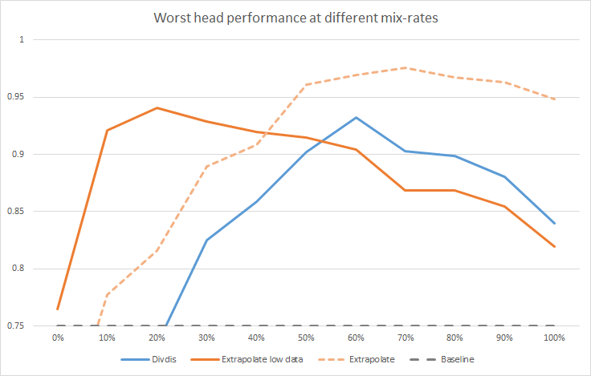

<body>
  
When citing this work, please include:

  <ul>
    <li>Armstrong, S; Cooper, J; Daniels-Koch, O; and Gorman, R, “The HappyFaces Benchmark”,” Aligned AI Limited published public benchmark, 2022.</li>
    <li>Arigbabu, OA, et al. "Smile detection using hybrid face representation." Journal of Ambient Intelligence and Humanized Computing (2016): 1-12.</li>
    <li>Sanderson, C and Lovell, BC, Multi-Region Probabilistic Histograms for Robust and Scalable Identity Inference. ICB 2009, LNCS 5558, pp. 199-208, 2009</li>
    <li>Huang, GB; Mattar, M; Berg, T and &nbsp;Learned-Miller, E (2007), Labeled faces in the wild: a database for studying face recognition in unconstrained environments. University of Massachusetts, Amherst, Technical Report</li>
  </ul>
  
We want to thank those who have contributed to making and labeling the faces we used in our benchmark.

  <h1>Diverse feature detection for safe generalisation</h1>
  
Why did&nbsp;a classifier&nbsp;that was&nbsp;trained to identify collapsed lungs <a href="https://www.google.com/url?q=https://arxiv.org/pdf/1909.12475.pdf&amp;sa=D&amp;source=editors&amp;ust=1657100505518245&amp;usg=AOvVaw0bnUI41eBLxoWx_AGjTjXM">end up detecting chest drains instead</a>?

  

  
Because the training data was&nbsp;insufficient to distinguish actual&nbsp;collapsed lungs from chest drains – a treatment&nbsp;for collapsed lungs. Chest drains are visually far simpler than collapsed lungs and the two features were correlated, so the algorithm was able to perform well by learning to identify the&nbsp;simplest feature.

  
Classifiers will generally learn the simplest&nbsp;feature that&nbsp;predicts the label, whether it is what we humans had in mind, or not.&nbsp;Human oversight can sometimes catch this error, but human oversight is slow, expensive, and not fully reliable (as the humans may not even realise what the algorithm is actually doing before a potentially dangerous&nbsp;mistake is made).

  
Detecting the ‘wrong’&nbsp;feature means that the classifier will fail to generalise as expected&nbsp;– when deployed on X-rays of real humans with real, untreated, collapsed lungs, it will classify them as healthy, since they don’t have a chest drain.

  
We can solve this problem by using algorithms which can detect multiple different&nbsp;features that explain the same label. One way of achieving this would be to train an ensemble of algorithms, such that each makes predictions based on different features in the input. When these algorithms disagree, clarification from a human can be requested.

  
This benchmark&nbsp;allows the design and testing of those sorts of algorithms. It uses a simple dataset of human faces with different expressions and different labels, which are fully correlated in a labeled set, but which differ in an unlabeled set that represents the data the algorithm may encounter upon deployment in the real world.

  <h1>The HappyFaces Benchmark</h1>
  
The aim of this benchmark is to encourage the design of classifiers that are capable of using multiple different features to classify the same image. The features themselves must be deduced by the classifiers without being specifically labeled, though they may use a large unlabeled dataset on which the features vary. We have constructed a benchmark where the features are very different: facial expressions versus written text.

  
The images in these datasets consist of smiling (Happy) or non-smiling (Sad) faces. The images themselves come from the <a href="https://www.google.com/url?q=http://vis-www.cs.umass.edu/lfw/&amp;sa=D&amp;source=editors&amp;ust=1657100505520188&amp;usg=AOvVaw0fQULfKZdMEzhOCcvPCQS8">Labeled Faces in the Wild</a>&nbsp;dataset, a publicly available dataset of faces, annotated with names.). The sub-lists of smiling and non-smiling faces come from the <a href="https://www.google.com/url?q=https://data.mendeley.com/datasets/yz4v8tb3tp/5&amp;sa=D&amp;source=editors&amp;ust=1657100505520444&amp;usg=AOvVaw1UMsN_B3i1l3Dt7RIyEXKx">Dataset for Smile Detection from Face Images</a>.

  
The images are modified by randomly printing “HAPPY” or “SAD” in red letters upon the image. Here are some typical examples:

  <table>
    <tr>
      <td colspan="1" rowspan="1">
        

      </td>
      <td colspan="1" rowspan="1">
        

      </td>
      <td colspan="1" rowspan="1">
        

      </td>
      <td colspan="1" rowspan="1">
        

      </td>
    </tr>
  </table>
  
The image names consist of the name of the person depicted (derived from the Labeled Faces in the Wild name for the file) followed by one of four tags:

  <ul>
    <li>FHWH (Face Happy, Writing HAPPY): Smiling faces with “HAPPY” written across them.</li>
    <li>FHWS (Face Happy, Writing SAD): Smiling faces with “SAD” written across them.</li>
    <li>FSWH (Face Sad, Writing HAPPY): Unsmiling faces with “HAPPY” written across them.</li>
    <li>FSWS (Face Sad, Writing SAD): Unsmiling faces with “SAD” written across them.</li>
  </ul>
  
FSWH and FSWS images in which the face and the writing do not express the same emotion are referred to as cross types.

  
The images are&nbsp;inside a folder named with&nbsp;the same tag – so a smiling face with “SAD” written on it has&nbsp;the FHWS tag in its name and is located&nbsp;in a FHWS subfolder.

  
The benchmark sets consist of three datasets, each constructed by randomly sampling from among the relevant images:

  <ul>
    <li>The labeled dataset. This contains only images with the ‘correct’&nbsp;text on them – FHWH and FSWS. It has 100 of each type, for a total of 200 images.</li>
    <li>The unlabeled dataset. This contains images of all four types, including the cross types – FHWS and FSWH. It has 150 images of each type, for a total of 600 images&nbsp;of which 300 are sampled for use during training according to a mix rate&nbsp;(see below).</li>
    <li>The validation dataset. This also contains images of all four types. It has 50 images of each type, for a total of 200 images.</li>
  </ul>
  
There are thus 200 images each of types FHWS and FSWH, and 300 images each of types FHWH and FSWS, for 1000 images total. A list of the names of each image and the dataset it belongs to is included as the file “images_list.txt”. We have also kept back a test dataset, of the same size and composition as the validation dataset.

  <h1>Benchmark performance</h1>
  
A binary classifier trained on the labeled data would learn to classify images based on text only, as the text perfectly correlates with the labels,and &nbsp;is a much simpler feature to learn than the facial expression. If this classifier was then used to infer the label for an ambiguous image – a cross type – it would then classify that image according to the text rather than the facial expression:

  <table>
    <tr>
      <td colspan="1" rowspan="1">
        

        
Train classifier once...

      </td>
      <td colspan="1" rowspan="1">
        

        
…classify or mis-classify ambiguous image

      </td>
    </tr>
  </table>
  
If the feature that we humans want the classifier to base its predictions on is actually the facial expression, we’re in trouble.

  
The challenge is then to develop an algorithm which produces two&nbsp;binary outputs for each image, where the first &nbsp;identifies happy facial expressions, and&nbsp;the second identifies the written text ‘HAPPY’.. Only labels for the images in the “labeled” dataset may be used during training. This labeled set has perfect correlation between facial expression and written text, so it is deliberately difficult to distinguish these two features.

  <table>
    <tr>
      <td colspan="1" rowspan="1">
        

        
Train multiple classifiers that differ on ambiguous images

      </td>
    </tr>
  </table>
  
Labels from the unlabeled&nbsp;set may not be used, either explicitly or implicitly (which means that, for example, there must be nothing informative about the order in which unlabeled images are fed to the classifiers, nor can the classifier make use of the names of the images, which do include feature information).

  <h2>Mix rate</h2>
  
Lee et al.&nbsp;propose <a href="https://www.google.com/url?q=https://arxiv.org/abs/2202.03418&amp;sa=D&amp;source=editors&amp;ust=1657100505526430&amp;usg=AOvVaw0e0lPEDPtGkfVGzRBuGrXR">Diversify and Disambiguate</a>, which works well when the unlabeled dataset is evenly balanced between all four image categories&nbsp;– but we cannot assume this to be true for arbitrary unlabelled datasets in the wild.Imbalanced datasets can, of course, be rebalanced – however this is akin to manual labeling and as such is prohibitively costly and difficult to scale.

  
Thus these methods must function at different mix rates. The mix rate is a real number between 0 and 1 that denotes the proportion of cross types&nbsp;(FHWS and FSWH) in the unlabeled dataset. A mix rate of 0 has only FHWH and FSWS (as per the labeled dataset), a mix rate of 0.5 has equal amounts in each category, while a mix rate of 1 has only cross types&nbsp;FHWS and FSWH.

  
An unlabeled dataset with a mix rate of&nbsp;r&nbsp;is constructed as follows:

  
&nbsp;images are randomly selected from the unlabeled FHWS subset. An equal number of images are&nbsp;randomly selected from the unlabeled FSWH subset.

  
Likewise, &nbsp;images are&nbsp;randomly selected from FHWH, and the same number&nbsp;from FSWS. Thus the&nbsp;unlabeled dataset always contains exactly 300 images (of the possible 600 in the full unlabeled dataset), no matter the mix rate.

  <h2>Assessing performance</h2>
  
Performance is&nbsp;assessed on the validation set only, according to the accuracy of the worst of the two outputs.&nbsp;

  
The validation dataset&nbsp;includes images from all four categories in equal quantities (50 images of each type).

  
Of the two outputs produced by the algorithm for each image, one should be designated the ‘face’ classifier, and the other the ‘writing’ classifier, such that the ‘face’ classifier positively identifies all images that contain a smiling facial expression (FHWH and FHWS), and the ‘writing’ classifier positively identifies all images that contain the written text ‘HAPPY’ (FHWH and FSWH).

  
Thus, perfect predictions would look like this:

  <table>
    <tr>
      <td colspan="1" rowspan="1">
        
Image Class

      </td>
      <td colspan="1" rowspan="1">
        
Output 1 (‘face’ classifier)

      </td>
      <td colspan="1" rowspan="1">
        
Output 2 (‘writing’ classifier)

      </td>
    </tr>
    <tr>
      <td colspan="1" rowspan="1">
        
FHWH (“Face Happy, Writing HAPPY”)

      </td>
      <td colspan="1" rowspan="1">
        
1

      </td>
      <td colspan="1" rowspan="1">
        
1

      </td>
    </tr>
    <tr>
      <td colspan="1" rowspan="1">
        
FHWS (“Face Happy, Writing SAD”)

      </td>
      <td colspan="1" rowspan="1">
        
1

      </td>
      <td colspan="1" rowspan="1">
        
0

      </td>
    </tr>
    <tr>
      <td colspan="1" rowspan="1">
        
FSWH (“Face Sad, Writing HAPPY”)

      </td>
      <td colspan="1" rowspan="1">
        
0

      </td>
      <td colspan="1" rowspan="1">
        
1

      </td>
    </tr>
    <tr>
      <td colspan="1" rowspan="1">
        
FSWS (“Face Sad, Writing SAD”)

      </td>
      <td colspan="1" rowspan="1">
        
0

      </td>
      <td colspan="1" rowspan="1">
        
0

      </td>
    </tr>
  </table>
  
Overall performance is the performance of the worst of the two classifiers.

  
A few performance benchmarks to bear in mind:

  <ul>
    <li>50%. If one or both of the classifiers classify randomly, the expected accuracy&nbsp;is around 50%. This is not good performance.</li>
    <li>75%. If both classifiers are perfectly correct on the labeled images (FHWH and FSWS) and guess randomly on the other images, expected accuracy&nbsp;is 50%+50%/2=75%. Accuracy&nbsp;must therefore be above 75% if the classifiers are truly detecting the distinct underlying features.</li>
  </ul>
  <h2>Current performance</h2>
  
In more realistic settings with large datasets from the wild,&nbsp;these ambiguous cross type&nbsp;images may rarely appear. For example, because chest drains are such a common intervention for treating collapsed lungs, images of collapsed lungs without&nbsp;chest drains may be poorly represented in the training set – and so it is all the more important to be able to learn from them effectively.

  
For this reason, &nbsp;our benchmark is particularly concerned with algorithms that perform well when very few ambiguous images are present in the unlabeled set – &nbsp;and so performance is calculated against two metrics:

  <ul>
    <li>What is the lowest mix-rate where the algorithm achieves greater than 90% accuracy?&nbsp;(Lower is better!)</li>
    <li>What is the average accuracy&nbsp;on&nbsp;&nbsp;mix-rates between 0%&nbsp;and 30%? (As measured by the AUC within this range, normalised so that perfect performance is 1)</li>
  </ul>
  
Below we show the performance of two different algorithms on this benchmark: <a href="https://www.google.com/url?q=https://arxiv.org/abs/2202.03418&amp;sa=D&amp;source=editors&amp;ust=1657100505534329&amp;usg=AOvVaw17YrXkJoExdTCsIbX3iPfc">Diversify and Disambiguate</a><a href="https://www.google.com/url?q=https://arxiv.org/abs/2202.03418&amp;sa=D&amp;source=editors&amp;ust=1657100505534621&amp;usg=AOvVaw1uZkCc-MJj0OWX9Od8AWAK">&nbsp;</a>(DivDis), and two versions of our forthcoming method Extrapolate, the second of which (Extrapolate low data) is tuned to optimise performance on sparse cross types:

  

  <h2>State Of The Art</h2>
  
The current state of the art performance on the HappyFaces benchmark provided by Extrapolate low data&nbsp;is as follows:

  <h3>92.48%&nbsp;accuracy&nbsp;at a mix-rate of 10%, averaged over eight randomly seeded runs.</h3>
  <h3>AUC&nbsp;of&nbsp;the mix-rate range of 0%-30%&nbsp;of&nbsp;0.903, also averaged over eight randomly seeded runs.</h3>
  
Please help us beat these benchmarks ^_^

</body>
</html>
